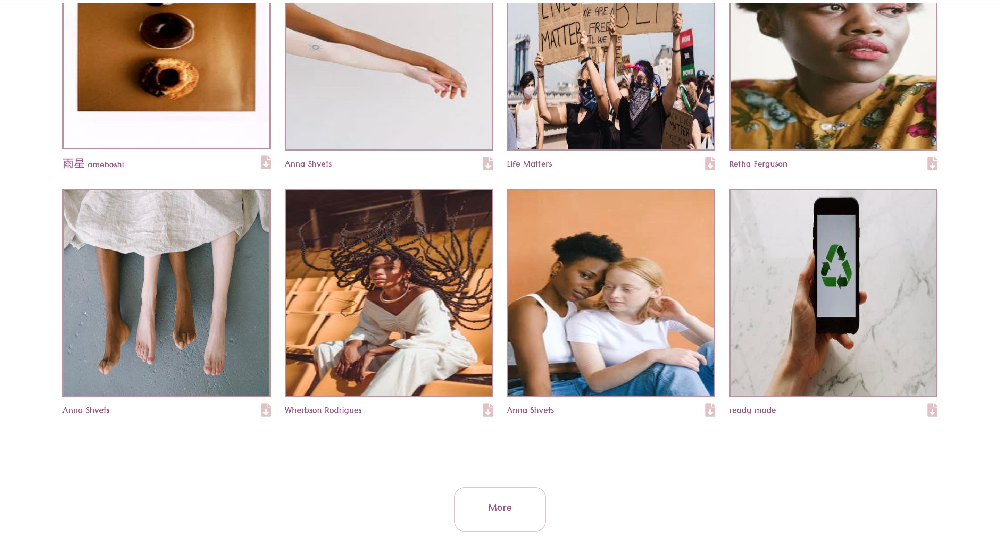

# DesktopHaven

SCREENSHOTS:

SUMMARY:

Motivation:

I wanted to create a web app where a user could download open source images and find new artist to follow.  

Features:
- View curated photos updated regularly
- Search images by topic
- View Photographer name
- Download image for personal use

API: 

[Pexel](https://www.pexels.com/)

LANGUAGES USED:

- HTML
- CSS
- JAVASCRIPT
- JQUERY

DEMO:

[Link](https://smonetc.github.io/DesktopHaven/)

