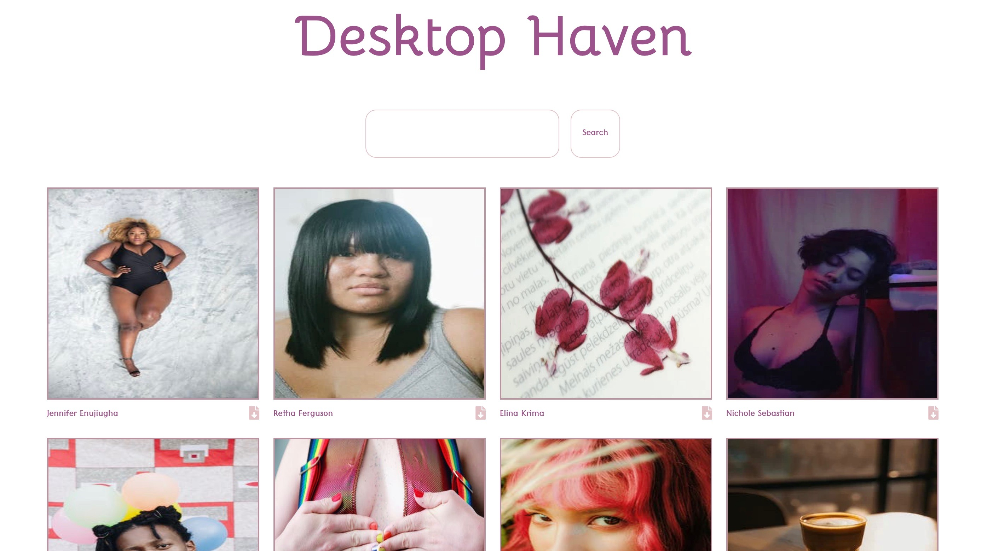

SCREENSHOTS:

Motivation:

I wanted to create a web app where a user could download open source images and find new artist to follow.  

API: 

https://www.pexels.com/

LANGUAGES USED:

- HTML
- CSS
- JAVASCRIPT
- JQUERY

FEATURES:
- View curated photos updated regularly
- Search images by topic
- View Photographer name
- Download image for personal use

DEMO:

https://smonetc.github.io/DesktopHaven/
